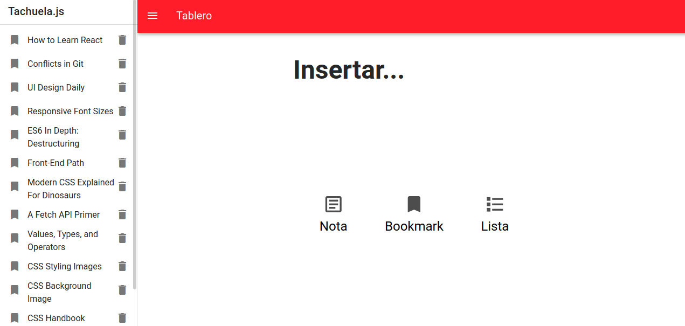

# Tachuela.js

Tachuela is an small Vue app that relies on a Vuex to store to allow the users to write notes, bookmarks and lists, there's no data persistence available yet. 

## Stack 

1. Vue
2. Vuex
3. Vuetify